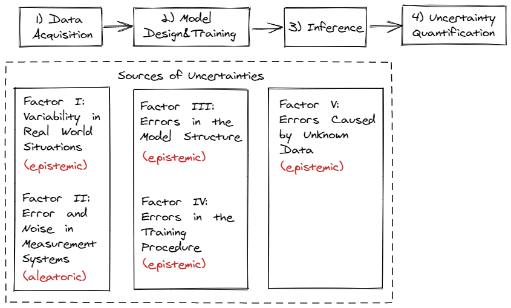

public:: true

- 
-
- # I. Introduction
	- [[Overconfident issue of DNN]]
	- ((61d9a61a-ed58-4ce4-af9d-5c7cefc6b02b))
	-
	- ((61d9a7f8-3263-4954-8b86-722c634f9a9b))
	-
	- **Main issues for mission- and safety-critical applications**:
		- the lack of expressiveness and transparency
		- the inability to distinguish between in-domain and out-of-domain samples [11], [12] and the sensitivity to domain shifts [13],
		- the inability to provide reliable uncertainty estimates for a  deep  neural  network’s  decision  [14]  and  frequently occurring overconfident predictions [15], [16],
		- the sensitivity to adversarial attacks that make deep neural networks vulnerable for sabotage [17], [18], [19].
		-
	- ((61d9ae79-228e-4ede-8943-b6b2a0364b59))
	-
	- ((61d9b956-26fe-4bd1-b18a-9bf2cdee56b3))
		- 鲁棒性测试方法 #ideas
		-
	- 其他综述文章
		- [[【综述】Wang-ACMCS-贝叶斯深度学习]]
		- [[【Thesis】Malinin]]
		- [[【综述】2021-Hüllermeier-Machine Learning-Aleatoric And Epistemic Uncertain]]
		- [[【综述】2020-survey-Information Fusion-predictive uncertainty]]
		-
- # II. Uncertainty in Deep Neural Networks
	- ^^面向不确定量化的学习过程^^
		-
		- [[draws/2022-01-09-10-42-40.excalidraw]]
		-
		-
	- 
	-
	- ((61dba35d-85be-49ab-9b10-b6301fc94b43))
	-
	- ^^Notations^^
		- Non-linear neural network $$f_\theta$$, with model parameters $$\theta$$ 
		  Measurable input set $$\mathbb{X}$$, and output set $$\mathbb{Y}$$
		  ((61da5fb0-248c-4378-ab33-69d92b090a54))
		- Finite set of training data $$\mathcal{D} \subseteq \mathbb{D}=\mathbb{X}\times\mathbb{Y}$$ containing N data  samples  and corresponding target, i.e.
		  $$\mathcal{D}=(\mathbb{X},\mathbb{Y})=\{x_i,y_i\}_{i=1}^N\subseteq \mathbb{D}$$
		- Prediction by the model trained on $$\mathcal{D}$$ for  a  new  data  sample $$x^*$$ 
		  $$f_\theta(x^*)=y^*$$
		  -
	- ## A.  Data Acquisition 【数据】
		- ### Factor I : Variability  in  Real  World  Situations （真实开放场景多变性）
			- ^^**Unsatisfied Assumption**^^
				- The training data $$x_1, x_2,\dots x_N$$ should be sufficiently cover the sample space Ω.
				- However, the real open situations encounter highly fluctuated environments, such as, the changes in temperature, illumination, clutter, and physical objects’ size and shape
			- ^^**Distribution Shift**^^
			  In general, the new sample holds $$x^*\neq x_i$$ for  all  training  situations $$x_i$$.
			  -
		- ### Factor  II:  Error  and  Noise  in  Measurement  Systems (Irreducible)（测量误差及噪声）
			- 1. Limitation of information, e.g., low image resolution, etc.
			  2. False  or insufficiently available  information  modalities
			  3. Imprecise measures caused by sensor noise, by motion, or mechanical stress
			  4. False labeling
			  5. Imbalance data
	- ## B.  Deep Neural Network Design and Training 【模型】
		- ### Factor  III:  Errors  in  the  Model  Structure (模型结构误差)
			- ^^**Inductive bias**^^or ^^**Strong Assumptions**^^
			  The assumptions  on  the  problem  structure  induced  by  the  design  and  training  of  the  neural  network.
				- The following is a list of common inductive biases in machine learning algorithms.
				  collapsed:: true
					- **Maximum conditional independence**: if the hypothesis can be cast in a Bayesian framework, try to maximize conditional independence. This is the bias used in the **Naïve Bayes classifier**.
					  **Minimum cross-validation error**: when trying to choose among hypotheses, select the hypothesis with the lowest cross-validation error. Although cross-validation may seem to be free of bias, the "no free lunch" theorems show that cross-validation must be biased.
					  **Maximum margin**: when drawing a boundary between two classes, attempt to maximize the width of the boundary. This is the bias used in **support vector machines**. The assumption is that distinct classes tend to be separated by wide boundaries.
					  **Minimum description length**: when forming a hypothesis, attempt to minimize the length of the description of the hypothesis.
					  **Minimum features**: unless there is good evidence that a feature is useful, it should be deleted. This is the assumption behind **feature selection algorithms**.
					  **Nearest neighbors**: assume that most of the cases in a small neighborhood in feature space belong to the same class. Given a case for which the class is unknown, guess that it belongs to the same class as the majority in its immediate neighborhood. This is the bias used in the **k-nearest neighbors algorithm**. The assumption is that cases that are near each other tend to belong to the same class.
			- ^^**Network’s  structure**^^ 
			  e.g.  the  number  of  parameters,  the layers, the activation functions, etc.
				- > **The number of parameters** affects the  memorization capacity,  which  can  lead  to  **under-  or over-fitting  on  the  training  data**.
				- >**Deeper networks** tend to be **overconfident** in their softmax output, meaning that they predict too much probability on the class with highest probability score.
		- ### Factor  IV:  Errors  in  the  Training  Procedure (训练过程误差)
			- ^^**Training process**^^
			   e.g. optimization  algorithm,  regularization,  augmentation, etc.
			- ^^**Hyper parameters**^^
			  e.g. batch size,  learning  rate,  stopping criteria, and  the  number  of  training  epochs, etc.
				- >  The problem of imbalanced data might be alleviated by applying augmentation to increase the variety or by balancing the impact of single classes son the loss function.
			- ^^**Stochasticity of Neural Networks**^^
				- Given model structure configuration $$s$$ and  a  training  data  set $$\mathcal{D}$$,the  training  of  a  neural  network  is  a  stochastic  process  and therefore the resulting neural network $$f_\theta$$ is based on a random variable
					- ((61daabe2-11a5-4a26-a0a5-bcbb258e4d9c))
				- Random factors:
					- e.g., the order of the data,  random initialization or random regularization as  augmentation or dropout.
				- Non-linear and non-convexity of neural network and the randomness in the training  process in general leads to **different local optima** $$\theta^*$$ resulting in different models, i.e., the same model parameterization leads to two training processes.
				-
	- ## C.  Inference 【推理】
		- ### Factor  V:  Errors Caused by Unknown Data
			- **Problematics of OOD** : a model trained on samples from a world $$\mathcal{W}_1$$, but inferenced on samples from a world $$\mathcal{W}_2$$
			- Inference-time uncertainty
			- Invalid data caused by failed sensors are not considered here.
	- ## D.  Predictive Uncertainty Model【预测不确定性建模及分解】
		- ### Importance of uncertainty awareness
			- For real world mission- and safety-critical applications, it is of paramount importance for a DNN model to be able to:
				- hand uncertain inputs;
				- remove or quantify the model uncertainty;
				- give a correct prediction of the data uncertainty.
		- ### Predictive uncertainty modelling
			- [[In Bayesian  framework]]:
				- ^^**Model uncertainty**^^ : a probability distribution over ^^**the model parameters**^^ $$\theta$$;
				- ^^**Data uncertainty**^^ : a probability distribution over ^^**the model outputs**^^ $$y^*$$,  given a parameterized model $$f_\theta$$.
					- ((61db0078-3386-46bb-8671-f34ab6003c90))
				- ^^**Distributional uncertainty**^^: represents the uncertainty on the actual network output, which refers to **uncertainty that is caused by a change in the input-data  distribution**.
					- Parameterizing a prior distribution over predictive distributions.
					  e.g.  for  classification  tasks  this  might be  a  Dirichlet  distribution,  which  is  a  distribution  over  the categorical distribution given by the softmax output.
					- ((61db96f4-aafd-426b-8174-f3198eea3f37))
					  id:: 61db95b6-3113-40f4-a5b6-aeba4788bf6b
			- Uncertainty propagation
			-
		- ### Approximation of $$p(\theta|\mathcal{D})$$
			-
	- ## E.  Uncertainty Classification
		- ### In-domain uncertainty (Reducible)
			- ((61db9c94-4047-4e83-9255-1f0789cca7fe))
			- ((61db9ceb-abeb-4a29-b442-6c71fb4f26ce))
		- ### Domain-shift uncertainty (Reducible)
			- ((61db9d61-02ac-42cb-ba2d-f62982466964))
				- e.g. City or forest
			- ((61db9da6-7f1b-4ac8-b053-aab3c345391f))
			- ((61db9e97-a584-4c40-b44a-87e0d30f179a))
				- [66] Regularization with Cutout
				- {:height 438, :width 686}
			- ### Out-of-domain uncertainty (Reducible)
				- ((61dba06e-1ae1-4e28-8ad9-5c84f439c371))
			- ((61dab276-80f4-4b29-bce7-90e47a03a75d))
	- ## Summary
		- ^^**Model uncertainty**^^: captures  all,  in-domain,  domain-shift,  and  out-of-domain uncertainties.
		- ^^**Data  uncertainty**^^: captures  in-domain  uncertainty  that  is  caused  by  the  nature  of the data the network is trained on, as for example overlapping samples and systematic label noise.
		-
		-
		-
		-
